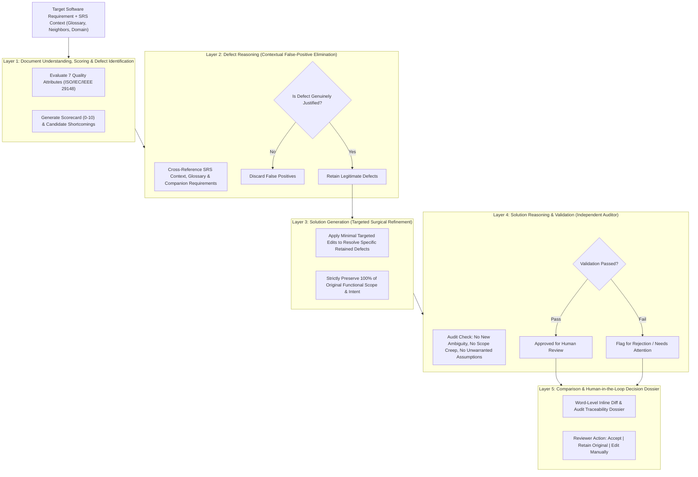

# LLM-Based Software Requirement Quality Analyzer

[](https://www.python.org/downloads/)
[](https://standards.ieee.org/ieee/29148/7342/)
[](https://opensource.org/licenses/MIT)
[]()

An AI-assisted Software Requirements Engineering editor and quality analyzer built around a structured **5-layer LLM pipeline**. 

Unlike single-shot rewriting tools that hallucinate modifications or alter business scope, this analyzer functions as a surgical, context-aware requirements editor. It rigorously audits requirements against formal **ISO/IEC/IEEE 29148:2018** standards, eliminates contextual false positives, performs minimal targeted refinements, and enforces independent auditor validation before presenting human reviewers with transparent side-by-side diffs.

---

## 🏛 Architecture Overview



---

## 🔬 The 5-Layer Pipeline Explained

### Layer 1: Document Understanding, Scoring & Shortcoming Identification
- **Purpose**: Evaluates individual requirements within the context of surrounding SRS sections against 7 standard quality dimensions:
  1. **Unambiguity**: Freedom from subjective adverbs ("quickly"), vague adjectives ("intuitive", "adequate"), or open-ended phrases.
  2. **Completeness**: Explicit inputs, preconditions, expected outputs, and error handling.
  3. **Consistency**: Terminological alignment with glossary and surrounding system requirements.
  4. **Conformance**: Normative modal auxiliary verb usage ("shall") and active syntactic structure.
  5. **Correctness**: Technical realism within stated domain constraints.
  6. **Singularity**: Single, indivisible requirement without compound conjunctions ("and shall also").
  7. **Verifiability / Feasibility**: Objectively testable via finite verification criteria.
- **Output**: Detailed 7-attribute scorecard, overall weighted score, and candidate shortcomings.

### Layer 2: Defect Reasoning (False-Positive Elimination)
- **Purpose**: Isolated requirement statements often appear incomplete or ambiguous when read in isolation, yet are completely clarified by the document glossary or a companion requirement. Layer 2 applies deep contextual reasoning to verify if a defect is genuinely problematic or an irrelevant false positive.
- **Output**: Each defect categorized as `JUSTIFIED` or `DISCARDED` with explicit contextual counter-evidence.

### Layer 3: Solution Generation (Targeted Refinement)
- **Purpose**: Generates surgical, targeted edits resolving *only* the retained justified defects.
- **Guarantees**:
  - Wholesale rewrites are strictly prohibited.
  - Core business logic, parameters, and functional intent remain 100% preserved.
  - Follows standard IEEE 29148 / EARS (Easy Approach to Requirements Syntax).

### Layer 4: Solution Reasoning & Validation (Independent Critic)
- **Purpose**: Acts as an independent auditor to prevent LLM hallucination and specification drift.
- **Audit Checks**:
  1. Did the edit genuinely resolve the defect?
  2. Were any new subjective terms or ambiguities introduced?
  3. Were unwarranted architectural or protocol assumptions introduced?
  4. Was original functional intent preserved without expansion or contraction?
  5. Does the syntax strictly conform to standard requirements grammar?
- **Output**: `VALIDATED` (approved for human review) or `REJECTED`.

### Layer 5: Comparison & Human-in-the-Loop Decision
- **Purpose**: AI-assisted editor interface providing full transparency for human sign-off.
- **Capabilities**:
  - Side-by-side view with word-level insertions `[+added+]` and deletions `[-removed-]`.
  - Rich terminal ANSI color rendering (Red strikethrough vs Green addition).
  - Decision state tracking: `ACCEPTED`, `REJECTED`, `EDITED_BY_HUMAN`.
  - Comprehensive Markdown audit report export.

---

## ⚡ Quickstart

### 1. Installation
Clone the repository and install dependencies:
```bash
git clone https://github.com/your-username/sqam-requirement-analyzer.git
cd sqam-requirement-analyzer
pip install -r requirements.txt
```

### 2. Environment Setup (Optional)
If you wish to use live LLMs (OpenAI or Gemini), set up your API keys:
```bash
cp .env.example .env
# Edit .env and enter your OPENAI_API_KEY or GEMINI_API_KEY
```
*(By default, the pipeline runs with a deterministic offline Mock client that requires no API keys or internet connection).*

### 3. Run Unit Tests (100% Passing)
```bash
python -m unittest discover -s tests -p "test_*.py" -v
```

### 4. Run the Showcase Demo
```bash
python example.py
```

---

## 💻 CLI Commands & Usage

### 1. Test Real SRS Documents Directly
Test any project PDF or Markdown file from `srs doc versions/`:
```bash
# Test Project 1 (FROG Gestures Recognizer)
python test_srs_doc.py --project 1_FROG --limit 3

# Test with interactive human sign-off
python test_srs_doc.py --project 1_FROG --limit 5 --interactive

# Test using Google Gemini or OpenAI
python test_srs_doc.py --project 1_FROG --provider gemini --model gemini-2.5-flash --limit 3
python test_srs_doc.py --project 1_FROG --provider openai --model gpt-4o --limit 3
```

### 2. Inspect 15 SRS Projects Dataset
```bash
# Inventory of all 15 folders
python build_dataset.py --list

# Inspect requirements in a specific project
python build_dataset.py --inspect 1_FROG
python build_dataset.py --inspect 2_SMIRK

# Generate/update benchmark dataset JSON
python build_dataset.py --generate-benchmark
```

### 3. Empirical Research Evaluation (SQAM Metrics)
Run the blind evaluation against later historical versions ($Version_{N+1}$):
```bash
python evaluate_srs.py --benchmark benchmark_15_projects.json --output report_15_projects.md
```
This automatically computes:
* **UAR** (User Acceptance Rate)
* **RRR** (Refinement Rejection Rate)
* **FSR** (Flawed Suggestion Rate)
* **IPR** (Intent Preservation Rate)
* **APL** (Average Pipeline Latency)
### 4. Historical SRS Version Evolution Pipeline (Pipeline 2)
Extract, align, and classify human modifications across document versions and evaluate Pipeline 1's refinements against actual stakeholder edits:
```bash
# Compare Version N and Version N+1 for any project
python run_evolution_pipeline.py --project 1_FROG --limit 10

# Compare arbitrary PDF or Markdown files
python run_evolution_pipeline.py --v1 "path/to/SRS_v1.0.pdf" --v2 "path/to/SRS_v2.0.pdf"

# Export Markdown report, CSV summary, and full JSON trace
python run_evolution_pipeline.py --project 1_FROG --output-markdown frog_evolution.md --output-csv frog_evolution.csv --output-json frog_trace.json

# Run with Gemini or OpenAI live LLMs
python run_evolution_pipeline.py --project 2_SMIRK --provider gemini --model gemini-2.5-flash
```

---

## 🔌 Swapping LLM Models

The pipeline is completely decoupled from any single LLM vendor via `BaseLLMClient`:

```python
from sqam_analyzer import (
    RequirementQualityPipeline,
    OpenAILLMClient,
    GeminiLLMClient,
    LangChainLLMClient,
    MockLLMClient,
)

# Option A: OpenAI (GPT-4o, GPT-4o-mini) or Local vLLM/Ollama
client = OpenAILLMClient(model_name="gpt-4o")

# Option B: Google Gemini
client = GeminiLLMClient(model_name="gemini-2.5-flash")

# Option C: Any LangChain BaseChatModel
from langchain_openai import ChatOpenAI
client = LangChainLLMClient(ChatOpenAI(model="gpt-4o"))

# Heterogeneous Pipeline (Optimizing cost and latency):
pipeline = RequirementQualityPipeline(
    layer1_llm=OpenAILLMClient(model_name="gpt-4o-mini"),  # Fast scoring
    layer2_llm=OpenAILLMClient(model_name="gpt-4o"),       # Deep reasoning
    layer3_llm=OpenAILLMClient(model_name="gpt-4o-mini"),  # Surgical editing
    layer4_llm=OpenAILLMClient(model_name="gpt-4o"),       # Adversarial critic
)
```

---

## 📦 Repository Structure

```
sqam-requirement-analyzer/
├── .gitignore                    # Comprehensive ignore rules
├── .env.example                  # Environment configuration template
├── requirements.txt              # Production dependency list
├── pyproject.toml                # Standard Python package specification
├── README.md                     # Documentation
├── main.py                       # CLI entry point for human review & export
├── example.py                    # End-to-end runnable showcase
├── test_srs_doc.py               # Direct test runner for real PDF/MD documents
├── build_dataset.py              # Dataset builder and parser for 15 SRS projects
├── evaluate_srs.py               # Research metrics & historical benchmark evaluator
├── run_evolution_pipeline.py     # Pipeline 2 runner: Version N vs N+1 evolution benchmark
├── sample_benchmark.json         # Version N vs N+1 benchmark dataset
├── sqam_analyzer/                # Pipeline 1: 5-Layer Quality Analyzer
│   ├── __init__.py               # Exports
│   ├── models.py                 # Pydantic data schemas
│   ├── llm_provider.py           # Swappable LLM clients (OpenAI, Gemini, LangChain, Mock)
│   ├── prompts.py                # ISO 29148 aligned prompt templates
│   ├── diff_utils.py             # Word-level diff and ANSI color markup
│   ├── pipeline.py               # 5-Layer Pipeline Orchestrator
│   ├── cli.py                    # Rich terminal UI
│   ├── evaluator.py              # Metrics computation harness
│   └── layers/
│       ├── base.py               # BaseLayer interface
│       ├── layer1_scorer.py      # Layer 1: Document Understanding & Scoring
│       ├── layer2_reasoner.py    # Layer 2: Defect Reasoning (False Positive Filter)
│       ├── layer3_generator.py   # Layer 3: Targeted Refinement
│       ├── layer4_validator.py   # Layer 4: Independent Auditor Validation
│       └── layer5_decision.py    # Layer 5: Comparison & Human Decision Dossier
├── srs_evolution/                # Pipeline 2: Historical Version Evolution Engine
│   ├── __init__.py               # Exports
│   ├── models.py                 # Pydantic schemas (Alignment, Taxonomy, Correspondence)
│   ├── aligner.py                # Document ingestion (PDF/MD) & multi-stage requirement alignment
│   ├── change_classifier.py      # LLM taxonomy classifier (ISO 29148 quality vs scope vs editorial)
│   ├── evaluator.py              # Semantic correspondence evaluator (Matched / Partial / Not Matched)
│   └── pipeline.py               # End-to-end evolution orchestrator & CSV/JSON exporter
├── tests/
│   ├── __init__.py
│   ├── test_pipeline.py          # Pipeline 1 unit test suite (13 tests)
│   └── test_evolution.py         # Pipeline 2 unit test suite (9 tests)
└── srs doc versions/             # 15 Versioned SRS Projects dataset
```

---

## 📄 License
This project is open-source under the [MIT License](LICENSE).
